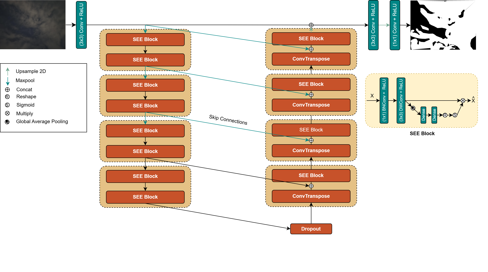
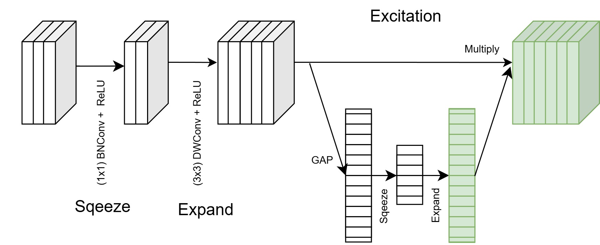

# **Sqeeze-Expand-Excite: Efficient UNet for Cloud Segmentation**

### Ifran Rahman Nijhum, Md Shihab Reza and Soumyabrata Dev

## Abstract
Cloud segmentation is vital for atmospheric observation and applications such as weather forecasting and solar forecasting. To date, many deep learning models for cloud segmentation have been proposed. However, there's a lack of studies on building efficient cloud segmentation networks facilitating deployment on edge devices. In this work, we propose SEE-Unet, an inspired version of the Squeeze U-Net and U-Net. Our SEE-Unet gains competitive performance while notably reducing computational complexity. Compared to U-Net, SEE U-Net reduces parameters by 96.7\% and FLOPs by over 56×. Against Squeeze U-Net, SEE U-Net achieves a 57\% reduction in parameters and a 41\% reduction in FLOPs. These results highlight the potential of SEE U-Net for lightweight, efficient cloud segmentation, particularly in resource-constrained environments.

## Network Architecture


SEE-Unet is based on the Sqeeze U-Net backbone but integrates the SEE Block instead of fire-module to enhance feature representation and segmentation accuracy while keeping the model size low.

## SEE Block


The SEE Block introduces an innovative method to capture fine spatial details while preserving edge integrity, ensuring better segmentation performance.

## Training and Evaluation
To train the SEE-Unet model, follow these steps:

### 1. Clone the repository:
```sh
git clone https://github.com/your-repo/SEE-Unet.git
cd SEE-Unet
```

### 2. Install dependencies:
```sh
pip install -r requirements.txt
```

### 3. Run the training script using the provided Jupyter Notebook:
```sh
jupyter notebook train.ipynb
```

## Citations
If you use SEE-Unet in your research, please cite our work using the following BibTeX reference:

```bibtex
@unpublished{SEEUnet2025,
  title={Sqeeze-Expand-Excite: Efficient UNet for Cloud Segmentation}, 
  author    = {Ifran Rahman Nijhum, Md Shihab Reza and Soumyabrata Dev},
  year      = {2025},
  note      = {Manuscript in preparation}
}

```

## Contact
For any inquiries or issues, please contact:

- **Ifran Rahman Nijhum**: ifran.nijhum@ucdconnect.ie
- **Project Repository**: [GitHub Repository](https://github.com/ifran-rahman/SEE-Unet)

---


